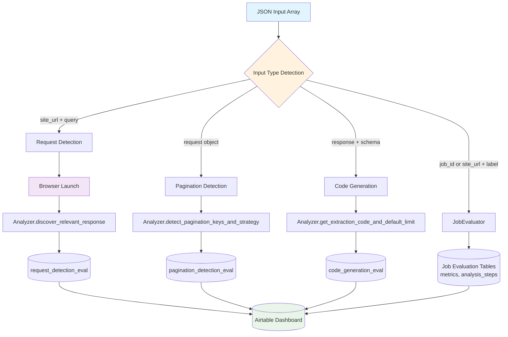

# Separate Task Evaluation System

## The Problem

Current evaluation framework only tests the full end-to-end pipeline:

- **No Component Isolation**: Can't test request detection, pagination detection, or code generation independently
- **Slow Feedback Cycles**: Full pipeline runs take time, making iteration on individual components inefficient
- **Unclear Failure Points**: When a job fails, it's hard to pinpoint which specific component caused the issue
- **Limited Testing Scope**: Can't benchmark individual algorithms or test edge cases for specific components
- **Development Bottlenecks**: Developers must run complete analysis jobs to test small component changes

## The Solution

The separate evaluation system enables isolated testing of individual Analyzer components: **request detection**, **pagination detection**, and **code generation**. Each component can be evaluated independently with targeted inputs and metrics.

**What the separate evaluation system provides:**

1. **Component Isolation** - Test each Analyzer method independently
2. **Faster Feedback** - Quick evaluation cycles for individual components
3. **Granular Metrics** - Component-specific accuracy measurements
4. **Targeted Debugging** - Isolate performance issues to specific algorithms
5. **Development Velocity** - Rapid iteration on individual component improvements

## System Architecture



## Component Testing Approach

**Three Task Evaluators:**

1. **Request Detection** → Tests source URL discovery accuracy
2. **Pagination Detection** → Tests pagination keys identification from API requests
3. **Code Generation** → Calculates default limit for extraction code

**Mixed Input Support:**

- Single command handles job evaluations + component evaluations
- Automatic input type detection and routing
- Unified reporting in Airtable dashboard

## 🧪 CLI Usage

```
$ uv run stroteval
Usage: stroteval [OPTIONS]

Evaluate multiple (existing/new jobs or separate components) from file or stdin.

╭─ Parameters ──────────────────────────────────────────────────────────────────╮
│ --file  -f  Path to the JSON/JSONL file. If not provided, reads from stdin.   │
╰───────────────────────────────────────────────────────────────────────────────╯
```

**Auto-Detection**: The evaluator automatically detects input types and routes to appropriate handlers:

- **Job Inputs**: `ExistingJobInput`, `NewJobInput` → `JobEvaluator`
- **Task Inputs**: `RequestDetectionInput`, `PaginationDetectionInput`, `CodeGenerationInput` → `TaskEvaluator`
- **Mixed Batches**: Supports combining job and separate inputs in single batch

### Request Detection Evaluation

Test how accurately the system discovers API endpoints:

```bash
echo '[
  {
    "site_url": "https://example.com/products",
    "query": "product listings with prices",
    "expected_source": "https://api.example.com/v1/products"
  },
  {
    "site_url": "https://reviews.site.com/product/123",
    "query": "customer reviews and ratings",
    "expected_source": "https://api.reviews.site.com/products/123/reviews"
  }
]' | uv run stroteval
```

### Pagination Detection Evaluation

Test pagination parameter identification accuracy:

```bash
echo '[
  {
    "request": {
      "method": "GET",
      "url": "https://api.example.com/products",
      "queries": {"page": 1, "limit": 20, "category": "electronics"},
      "type": "ajax",
      "headers": {},
      "post_data": null
    },
    "expected_pagination_keys": ["page", "limit"]
  },
  {
    "request": {
      "method": "POST",
      "url": "https://api.store.com/search",
      "queries": {},
      "type": "ajax",
      "headers": {},
      "post_data": {"cursor": "eyJpZCI6MTIzfQ==", "size": 50}
    },
    "expected_pagination_keys": ["cursor", "size"]
  }
]' | uv run stroteval
```

### Code Generation Evaluation

Test extraction code generation and entity counting:

```bash
echo '[
  {
    "response": {
      "value": "{\"products\": [{\"name\": \"iPhone\", \"price\": 999}, {\"name\": \"iPad\", \"price\": 599}]}", # If value is empty, the evaluator will use the request to fetch the response
      "request": {
        "method": "GET",
        "url": "https://api.example.com/products",
        "queries": {},
        "type": "ajax",
        "headers": {},
        "post_data": null
      }
    },
    "output_schema_file": "/path/to/product_schema.json",
    "expected_entity_count": 2
  }
]' | uv run stroteval
```

### Mixed Evaluation (Jobs + Components)

Combine job evaluations with separate component evaluations in a single batch:

```bash
echo '[
  {
    "job_id": "existing-job-uuid-123",
    "expected_source": "https://api.example.com/reviews",
    "expected_pagination_keys": ["cursor", "limit"],
    "expected_entity_count": 150
  },
  {
    "site_url": "https://shop.example.com",
    "query": "product catalog",
    "expected_source": "https://api.example.com/catalog"
  },
  {
    "request": {
      "method": "GET",
      "url": "https://api.example.com/catalog",
      "queries": {"offset": 0, "limit": 25},
      "type": "ajax",
      "headers": {},
      "post_data": null
    },
    "expected_pagination_keys": ["offset", "limit"]
  },
  {
    "response": {
      "value": "{\"items\": [/* ... 25 product objects ... */]}",
      "request": {
        "method": "GET",
        "url": "https://api.example.com/catalog",
        "queries": {},
        "type": "ajax",
        "headers": {},
        "post_data": null
      }
    },
    "output_schema_file": "./schemas/product.json",
    "expected_entity_count": 25
  }
]' | uv run stroteval
```

## Expected Results

### Request Detection Output

**Input:** Site URL + Query → **Output:** Airtable record with source matching accuracy

### Pagination Detection Output

**Input:** Request object → **Output:** Airtable record with parameter detection accuracy

### Code Generation Output

**Input:** Response + Schema → **Output:** Airtable record with entity count accuracy

### Mixed Evaluation Output

**Input:** Combined job + component inputs → **Output:** Unified Airtable dashboard with all evaluation results
